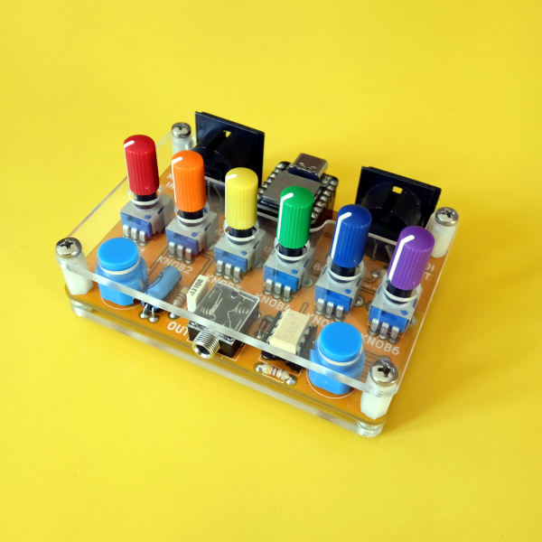

## multi

**What is multi?**  
**multi** is an open hardware circuit board hosting a [Seeeduino XIAO](https://wiki.seeedstudio.com/Seeeduino-XIAO/), 6 pots, 2 pushbuttons, 2 Midi DIN connectors and an audio output.   
The Seeeduino XIAO board carries the powerful ATSAMD21G18A-MU which is a low-power microcontroller and has 14 GPIO PINs, a DAC output and one UART interface. To avoid grounding loops the MIDI input is properly opto-isolated, as required by official specifications.    

**Bend multi to your needs**  
The strong point is that you can program your **multi** as you need, using the Arduino IDE. 
On the MIDI side, possible use includes advanced midi controlling, filtering and remapping as well as algorithmic arpeggiators and aleatoric patch generators. It's also perfect to explore digital synthesis techniques. 
 
**Software**    
 There are already several usable software and the list is constantly expanding:    

- **synth sequencer** three oscillators monophonic synth with embedded sequencer. It receives MIDI clock and note messages
- **drone** it's a six oscillators drone machine   
- **euclidean sequencer** receives midi clock, start/stop on the MIDI DIN input, generates euclidean rhythmes on the MIDI DIN output
- **bytebeat player** allows to play algorithmic music with no instruments and no real oscillators but a math expression that creates an audio output waveform as a function of time, processed 8000 times per second. The expression has six parameters accessible through the **multi** knobs
- **fourier** 3 voices drone generator, each voice is composed by six oscillators tuned on the harmonic overtones, each voice has six lfos
- **cc scrambler** generates random synthesizer patch by spitting out random MIDI CC values (preset fucker)    
- **multimode** keep pressed PB1 and PB2 to choose the mode between: synth sequencer, drone, euclidean sequencer, bytebeat player, fourier and cc scrambler 
- **midi converter** is a USB to 5 DIN bi-directional MIDI converter    
- **midi metronome** takes the MIDI clock from the 5 DIN midi connector and generates a metronome click on the audio output, to allow acoustic musicians to synchronize their performance to an electronic setup     
- **hardware test** if you have choosen the DIY kit you may want to use this software to test your build    
- **fm** a simple fm synth    
- **blink** the ubiquitous blink sketch    

To compile and upload the software on the Seeduino Xiao, you'll need:
- [Arduino IDE](https://www.arduino.cc/en/software)
- [Midi library](https://github.com/FortySevenEffects/arduino_midi_library)
- [Mozzi library](https://github.com/sensorium/Mozzi)
- [Adafruit TinyUSB Library for Arduino](https://github.com/adafruit/Adafruit_TinyUSB_Arduino) **version 0.10.5 (downgrade it using the [library manager](https://learn.adafruit.com/adafruit-all-about-arduino-libraries-install-use/library-manager))**

You can follow the [instructions to get started](https://wiki.seeedstudio.com/Seeeduino-XIAO/#software) on the SeeedStudio wiki.

 **Sound generation**    
Since the Xiao board has a DAC, **multi** can also be used to produce sounds using the [Mozzi sonification library](https://github.com/sensorium/Mozzi) written by Tim Barrass or accessing directly to the DAC output.
And if you ever wanted some ’80s-era distopia movie (background) music for your daily life, Tod Kurt has a [repository](https://github.com/todbot/mozzi_experiments) with some interesting sketches ready to run on the SAMD21.

