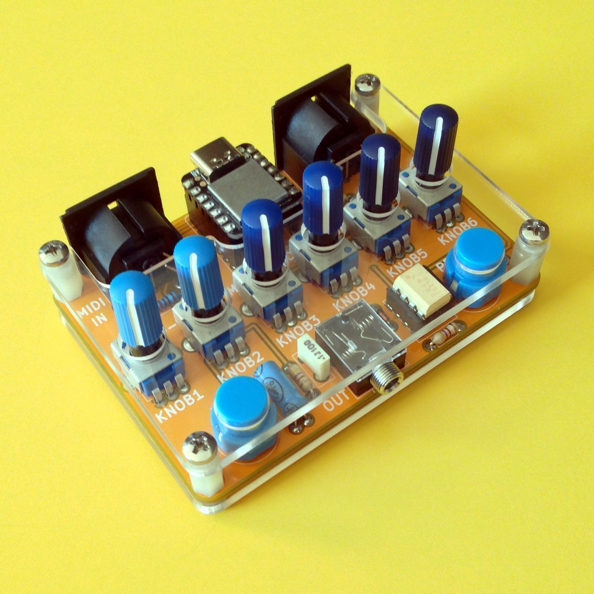

# multi

What is multi?
It's up to you...

- usb to 5din midi converter  
- noise blaster  
- midi filter  
- algorithmic sequencer  
- sample mangler
- midi router  
- sound generator (many thanks to Tim Barrass for the )

It's a fully programmable fuckery, enjoy it!

