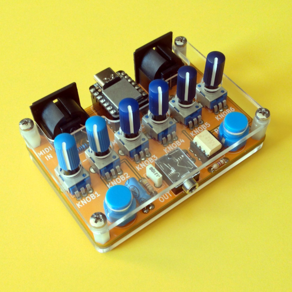

## multi

### What is multi?
It's a PCB (shield/hat) hosting a seeeduino [Xiao](https://wiki.seeedstudio.com/Seeeduino-XIAO/).

It has 6 potentiometers, 2 pushbuttons and a 1/8" audio out connected to the Xiao DAC.

**multi** can be used in many ways:

- advanced midi controller
- usb to 5din midi converter  
- midi filter  
- algorithmic sequencer  
- sample mangler
- midi router  
- sound generator (many thanks to Tim Barrass for the )

The project is open hardware/open source.

In the _multi_gerber_ directory you can find the fabrication files and the _multi_software_ directory contains the software written so far.
